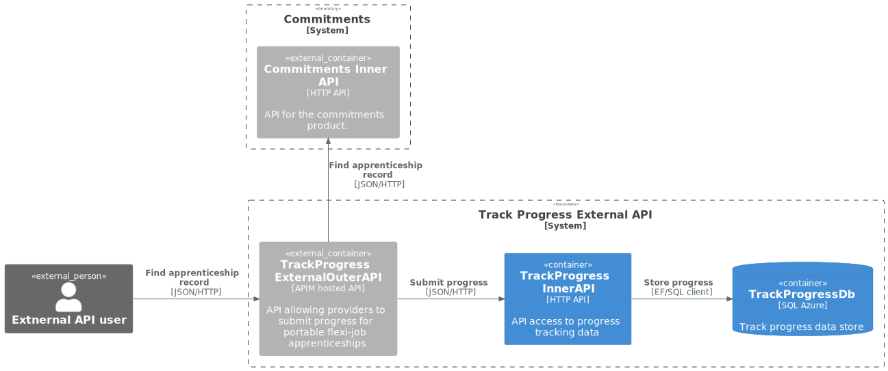

## ⛔Never push sensitive information such as client id's, secrets or keys into repositories including in the README file⛔

# Track Progress inner API

The Track Progress inner API provides the implementation of Track Progress domain.

## How It Works

A standard Inner API

## 🚀 Installation

### Pre-Requisites

* A clone of this repository

### Config

Configuration as per [Track Progress Employer Config](https://github.com/SkillsFundingAgency/das-employer-config/tree/master/das-trackprogress-api/SFA.DAS.ApprenticeAccounts.Api.json)

## 🐛 Known Issues
